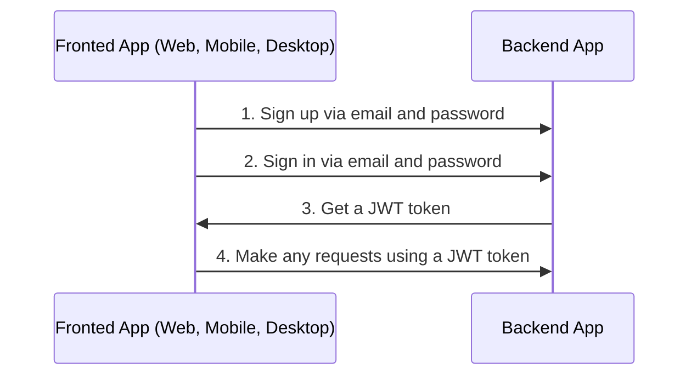
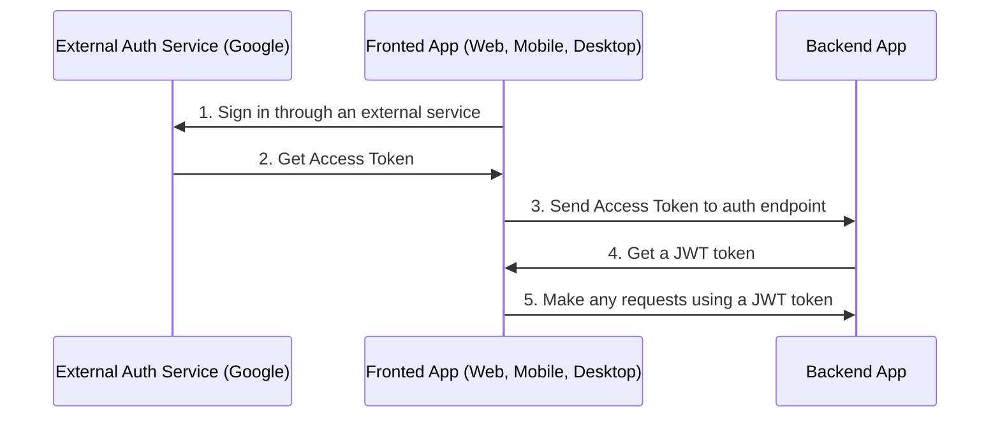

# Autenticação

## Sumário <!-- omit in toc -->

- [Informações gerais](#informações-gerais)
  - [Fluxo de autenticação por e-mail](#fluxo-de-autenticação-por-e-mail)
  - [Fluxo de autenticação por serviços externos/redes sociais](#fluxo-de-autenticação-por-serviços-externosredes-sociais)
- [Configurar Autenticação](#configurar-autenticação)
- [Login com Google](#login-com-google)
- [Sobre a estratégia JWT](#sobre-a-estratégia-jwt)
- [Fluxo de refresh token](#fluxo-de-refresh-token)
  - [Suporte a múltiplos dispositivos / Sessões](#suporte-a-múltiplos-dispositivos--sessões)
- [Logout](#logout)
- [Perguntas e Respostas](#perguntas-e-respostas)
  - [Após `POST /api/v1/auth/logout` ou remover a sessão do banco, o usuário ainda consegue fazer requisições com `access token` por um tempo. Por quê?](#após-post-apiv1authlogout-ou-remover-a-sessão-do-banco-o-usuário-ainda-consegue-fazer-requisições-com-access-token-por-um-tempo-por-quê)

---

## Informações gerais

### Fluxo de autenticação por e-mail

Por padrão, o projeto usa login e cadastro via e-mail e senha.



<https://user-images.githubusercontent.com/6001723/224566194-1c1f4e98-5691-4703-b30e-92f99ec5d929.mp4>

### Fluxo de autenticação por serviços externos/redes sociais

Você também pode se autenticar por serviços externos/redes sociais via Google (outros provedores podem ser adicionados de forma semelhante).



Para autenticar com serviço externo (Google), você precisa:

1. Autenticar no serviço externo e obter o(s) access token(s).
1. Chamar um dos endpoints abaixo com o access token obtido no frontend e receber o JWT do backend.

   ```text
   POST /api/v1/auth/google/login
   ```

1. Fazer requisições usando o JWT

---

## Configurar Autenticação

1. Gere chaves secretas para `access token` e `refresh token`:

   ```bash
   node -e "console.log('\nAUTH_JWT_SECRET=' + require('crypto').randomBytes(256).toString('base64') + '\n\nAUTH_REFRESH_SECRET=' + require('crypto').randomBytes(256).toString('base64') + '\n\nAUTH_FORGOT_SECRET=' + require('crypto').randomBytes(256).toString('base64') + '\n\nAUTH_CONFIRM_EMAIL_SECRET=' + require('crypto').randomBytes(256).toString('base64'));"
   ```

1. No arquivo `/.env`, substitua `AUTH_JWT_SECRET` e `AUTH_REFRESH_SECRET` pelos valores gerados no passo anterior.

   ```text
   AUTH_JWT_SECRET=HERE_SECRET_KEY_FROM_STEP_1
   AUTH_REFRESH_SECRET=HERE_SECRET_KEY_FROM_STEP_1
   ```

 

## Login com Google

1. Você precisa de `CLIENT_ID` e `CLIENT_SECRET`. Encontre-os no [Developer Console](https://console.cloud.google.com/): selecione seu projeto (ou crie em https://console.cloud.google.com/projectcreate) -> `APIs & services` -> `credentials`.
1. Altere `GOOGLE_CLIENT_ID` e `GOOGLE_CLIENT_SECRET` no `.env`

   ```text
   GOOGLE_CLIENT_ID=abc
   GOOGLE_CLIENT_SECRET=abc
   ```

## Sobre a estratégia JWT

No método `validate` do arquivo `src/auth/strategies/jwt.strategy.ts`, não verificamos se o usuário existe no banco por ser redundante. Isso pode anular os benefícios do JWT e afetar a performance.

Para entender melhor como o JWT funciona, veja o vídeo https://www.youtube.com/watch?v=Y2H3DXDeS3Q e leia https://jwt.io/introduction/

```typescript
// src/auth/strategies/jwt.strategy.ts

@Injectable()
export class JwtStrategy extends PassportStrategy(Strategy, 'jwt') {
  // ...

  public validate(payload) {
    if (!payload.id) {
      throw new UnauthorizedException();
    }

    return payload;
  }
}
```

> Se precisar buscar informações completas do usuário, faça isso nos services.

## Fluxo de refresh token

1. Ao autenticar (`POST /api/v1/auth/email/login`), você recebe `token`, `tokenExpires` e `refreshToken` na resposta.
1. Em cada requisição regular, envie o `token` no header `Authorization`.
1. Se o `token` expirar (verifique via `tokenExpires` no cliente), envie o `refreshToken` para `POST /api/v1/auth/refresh` (no header `Authorization`) para renovar o `token`. A resposta trará novo `token`, `tokenExpires` e `refreshToken`.


### Suporte a múltiplos dispositivos / Sessões

O projeto suporta login em múltiplos dispositivos via fluxo de Refresh Token. Isso é possível graças a `sessions`. Ao logar, cria-se uma sessão no banco contendo `sessionId (id)`, `userId` e `hash`.

Em cada `POST /api/v1/auth/refresh`, comparamos o `hash` do banco com o do Refresh Token. Se forem iguais, retornamos novo `token`, `tokenExpires` e `refreshToken`, e atualizamos o `hash` no banco para invalidar o token anterior.

## Logout

1. Chame o endpoint:

   ```text
   POST /api/v1/auth/logout
   ```

2. Remova `access token` e `refresh token` do seu app cliente (cookies, localStorage, etc.).

## Perguntas e Respostas

### Após `POST /api/v1/auth/logout` ou remover a sessão do banco, o usuário ainda consegue fazer requisições com `access token` por um tempo. Por quê?

Porque usamos `JWT`. `JWTs` são stateless, então não é possível revogá-los imediatamente. Isso é esperado: o access token expira conforme `AUTH_JWT_TOKEN_EXPIRES_IN` (padrão: 15 min). Se ainda assim precisar revogar de imediato, você pode verificar a existência de sessão em [jwt.strategy.ts](https://github.com/uisam00/conectar-backend/blob/master/src/auth/strategies/jwt.strategy.ts) a cada requisição, porém não é recomendado por impactar a performance.

---

Anterior: [Banco de Dados](database.md)

Próximo: [Serialização](serialization.md)
