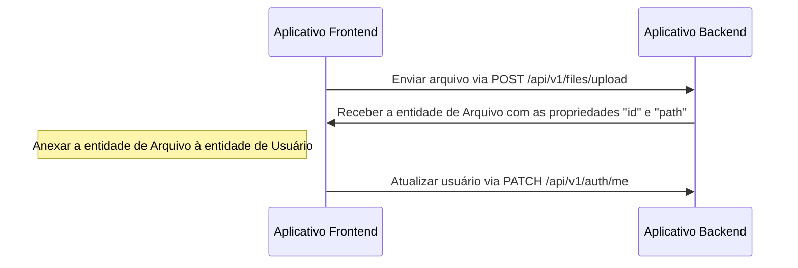
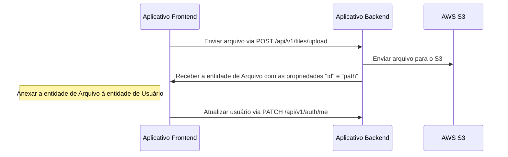
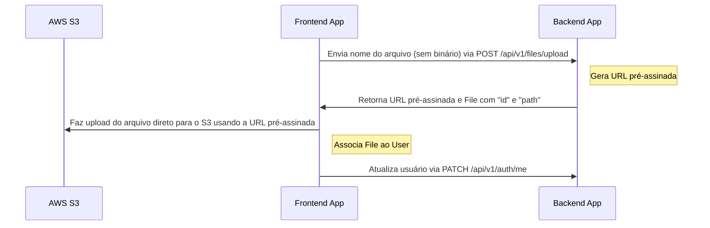

# Upload de arquivos

---

## Sumário <!-- omit in toc -->

- [Drivers suportados](#drivers-suportados)
- [Fluxo de upload e associação de arquivo para driver `local`](#fluxo-de-upload-e-associação-de-arquivo-para-driver-local)
  - [Exemplo: upload de avatar no perfil do usuário (local)](#exemplo-upload-de-avatar-no-perfil-do-usuário-local)
- [Fluxo de upload e associação de arquivo para driver `s3`](#fluxo-de-upload-e-associação-de-arquivo-para-driver-s3)
  - [Configuração para o driver `s3`](#configuração-para-o-driver-s3)
  - [Exemplo: upload de avatar no perfil do usuário (S3)](#exemplo-upload-de-avatar-no-perfil-do-usuário-s3)
- [Fluxo de upload e associação de arquivo para driver `s3-presigned`](#fluxo-de-upload-e-associação-de-arquivo-para-driver-s3-presigned)
  - [Configuração para o driver `s3-presigned`](#configuração-para-o-driver-s3-presigned)
  - [Exemplo: upload de avatar no perfil do usuário (URL pré-assinada S3)](#exemplo-upload-de-avatar-no-perfil-do-usuário-url-pré-assinada-s3)
- [Como excluir arquivos?](#como-excluir-arquivos)

---

## Drivers suportados

O projeto suporta os drivers: `local`, `s3` e `s3-presigned`. Você define isso no arquivo `.env` pela variável `FILE_DRIVER`. Se quiser usar outro serviço de armazenamento, é possível estender.

> Em produção, recomendo o driver "s3-presigned" para reduzir carga no servidor.

---

## Fluxo de upload e associação de arquivo para driver `local`

O endpoint `/api/v1/files/upload` recebe o upload e retorna a entidade `File` com `id` e `path`. Após receber a entidade `File`, você pode associá-la a outra entidade.

### Exemplo: upload de avatar no perfil do usuário (local)



## Fluxo de upload e associação de arquivo para driver `s3`

O endpoint `/api/v1/files/upload` recebe o upload e retorna a entidade `File` com `id` e `path`. Após receber a entidade `File`, você pode associá-la a outra entidade.

### Configuração para o driver `s3`

1. Acesse https://s3.console.aws.amazon.com/s3/buckets
1. Clique em "Create bucket"
1. Crie um bucket (por exemplo, `your-unique-bucket-name`)
1. Abra o bucket
1. Vá na aba "Permissions"
1. Encontre a seção "Cross-origin resource sharing (CORS)"
1. Clique em "Edit"
1. Cole a seguinte configuração

    ```json
    [
      {
        "AllowedHeaders": ["*"],
        "AllowedMethods": ["GET"],
        "AllowedOrigins": ["*"],
        "ExposeHeaders": []
      }
    ]
    ```

1. Clique em "Save changes"
1. Atualize o `.env` com as variáveis:

    ```dotenv
    FILE_DRIVER=s3
    ACCESS_KEY_ID=YOUR_ACCESS_KEY_ID
    SECRET_ACCESS_KEY=YOUR_SECRET_ACCESS_KEY
    AWS_S3_REGION=YOUR_AWS_S3_REGION
    AWS_DEFAULT_S3_BUCKET=YOUR_AWS_DEFAULT_S3_BUCKET
    ```

### Exemplo: upload de avatar no perfil do usuário (S3)



## Fluxo de upload e associação de arquivo para driver `s3-presigned`

O endpoint `/api/v1/files/upload` é usado para iniciar o upload. Nesse caso, o endpoint recebe apenas `fileName` (sem o binário) e retorna uma `URL pré-assinada` e a entidade `File` com `id` e `path`. Após receber a `URL pré-assinada` e a entidade `File`, faça o upload do binário diretamente para a `URL pré-assinada` e, em seguida, associe o `File` a outra entidade.

### Configuração para o driver `s3-presigned`

1. Acesse https://s3.console.aws.amazon.com/s3/buckets
1. Clique em "Create bucket"
1. Crie um bucket (por exemplo, `your-unique-bucket-name`)
1. Abra o bucket
1. Vá na aba "Permissions"
1. Encontre a seção "Cross-origin resource sharing (CORS)"
1. Clique em "Edit"
1. Cole a seguinte configuração

    ```json
    [
      {
        "AllowedHeaders": ["*"],
        "AllowedMethods": ["GET", "PUT"],
        "AllowedOrigins": ["*"],
        "ExposeHeaders": []
      }
    ]
    ```

   Para produção, recomendamos uma configuração mais restrita:

   ```json
   [
     {
       "AllowedHeaders": ["*"],
       "AllowedMethods": ["PUT"],
       "AllowedOrigins": ["https://your-domain.com"],
       "ExposeHeaders": []
     },
      {
        "AllowedHeaders": ["*"],
        "AllowedMethods": ["GET"],
        "AllowedOrigins": ["*"],
        "ExposeHeaders": []
      }
   ]
   ```

1. Clique em "Save changes"
1. Atualize o `.env` com as variáveis:

    ```dotenv
    FILE_DRIVER=s3-presigned
    ACCESS_KEY_ID=YOUR_ACCESS_KEY_ID
    SECRET_ACCESS_KEY=YOUR_SECRET_ACCESS_KEY
    AWS_S3_REGION=YOUR_AWS_S3_REGION
    AWS_DEFAULT_S3_BUCKET=YOUR_AWS_DEFAULT_S3_BUCKET
    ```

### Exemplo: upload de avatar no perfil do usuário (URL pré-assinada S3)



## Como excluir arquivos?

Preferi não excluir arquivos para evitar uma experiência negativa ao restaurar dados. Pelo mesmo motivo, usei Soft-Delete no banco de dados ([TypeORM Soft-Delete](https://orkhan.gitbook.io/typeorm/docs/delete-query-builder#soft-delete)). Porém, se precisar excluir, crie seu próprio handler, cronjob, etc.

---

Anterior: [Serialização](serialization.md)

Próximo: [Testes](tests.md)
